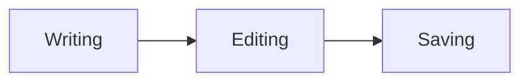

# Viem Markdown demo

Open this file in Markdown Source, then switch to Markdown WYSIWYG. The original source is preserved when switching views and when saving without edits.

## Paragraphs and line breaks

This sentence is written across
several source lines. In WYSIWYG they form one flowing paragraph.

This is a separate paragraph, with **bold**, *italic*, ***bold italic***, and ~~strikethrough~~ text. Nested formatting includes **bold with *italic inside*** and *italic with **bold inside***.

Underscores inside identifiers stay literal: `snake_case_name` and snake_case_name. Escaped punctuation also stays literal: \*stars\*, \_underscores\_, \[brackets\], and \# a hash.

This line ends with two spaces.  
This line ends with a backslash.\
This line uses an inline HTML break.<br>
All four lines belong to one paragraph.

Character references: &amp; &lt; &gt; &quot; &copy; &eacute; &#9733; &#x1F642;.

### Heading level three ###

#### Heading level four

##### Heading level five

###### Heading level six

Setext heading level one
========================

Setext heading level two
------------------------

## Lists and containers

- A tight bullet list
- A second item with **bold** text
  - A nested bullet
    1. A nested numbered item
    2. Another nested numbered item
- A final top-level bullet

1. A numbered list
2. The second item
3. The third item

A separate numbered list can begin at a different number:

7. A list may start at a number other than one.
8. Its displayed numbers continue from that start.

- This is a loose list.

- Its items have paragraph spacing.

  This is a second paragraph within the same item.

- ### A heading inside a list

  > A quotation inside this item.

  ```
  Literal code inside this item.
  ```

> A block quotation with **bold** and *italic*.
>
> A second paragraph inside the quotation.
>
> > A nested quotation has its own inset and border.
>
> ### A heading inside a quotation
>
> - A quoted list item
> - Another quoted list item
>
> ```
> Quoted code keeps the Code Block style.
> *These asterisks remain literal.*
> ```

## Links and visible references

An ordinary [inline link](https://example.com "Example title") hides its destination in WYSIWYG and uses the Link style. A [**formatted link label**](https://example.com/path) can contain emphasis.

Angle autolinks: <https://example.com> and <writer@example.com>.

Automatic links: https://example.com/path, www.example.com, and writer@example.com.

Viem intentionally keeps images and reference links visible, with their brackets, in the light-purple Markdown reference character style:


[Full reference][example]

[example][]

[example]

![Reference image][example-image]

[example]: https://example.com "A reference definition"
[example-image]: example-image.png

## Literal code

Inline `code` is monospaced and dark green. Double backticks allow a literal backtick: ``code with a ` backtick``. Code does not interpret *emphasis*, &amp;, or links.

```rust
// A language annotation is retained; syntax highlighting is not enabled.
fn main() {
    println!("Hello, Viem!");
}
```

~~~
Tilde fences work too.
**literal bold markers** and <b>literal HTML</b>
~~~

  ```
  This fence is indented by two spaces.
    These two additional spaces stay in the code.
  ```

    Four spaces start an indented code block.
    Blank lines within the block remain literal.

        Extra indentation is retained.

## Thematic breaks

Three supported spellings of a horizontal rule follow, with a paragraph between each so they can be inspected separately.

---

The first rule uses hyphens.

* * *

The second uses spaced asterisks.

___

The third uses underscores.

## Passive HTML and comments

Inline HTML supports <b>bold</b>, <em>emphasis</em>, <del>deleted text</del>, <code>code</code>, <kbd>keyboard text</kbd>, H<sub>2</sub>O, and x<sup>2</sup>.

A visible <!-- inline comment --> uses the Comment character style.

<!-- A standalone comment remains visible and editable in Viem. -->

<div>
<p>An HTML paragraph with <strong>strong text</strong>.</p>
<p>Markdown *inside this raw HTML block* remains literal.</p>
</div>

<pre>Preformatted HTML preserves
    indentation and line breaks.</pre>

## Intentional empty paragraphs

The larger separator below keeps an editable empty paragraph in Viem.


This paragraph follows that empty paragraph. GitHub collapses surplus blank separator lines.

## Unsupported GitHub features

The following examples intentionally demonstrate features that Viem does not implement. Image and reference syntax above is also an intentional visible-syntax treatment, rather than GitHub's rendered images or resolved reference labels.

### Tables

| Feature | Status |
| :--- | ---: |
| Table layout | Deferred |
| Cell alignment | Deferred |

### Task-list checkboxes

- [ ] An unchecked task remains ordinary list text.
- [x] A checked task does not become an interactive checkbox.

### Footnotes and alerts

A footnote reference[^demo-note] does not create a note or backlink.

[^demo-note]: This remains source text.

> [!NOTE]
> Alert titles and icons are not implemented.

### Math and diagrams

Inline math stays literal: $x^2 + y^2 = z^2$.

$$
\int_0^1 x^2\,dx = \frac{1}{3}
$$



### Other GitHub features

Emoji shortcodes such as :smile: stay literal. Repository mentions such as @example, issue references such as #123, generated heading anchors, and a navigable table of contents are not implemented. Fenced language names do not enable syntax highlighting.
