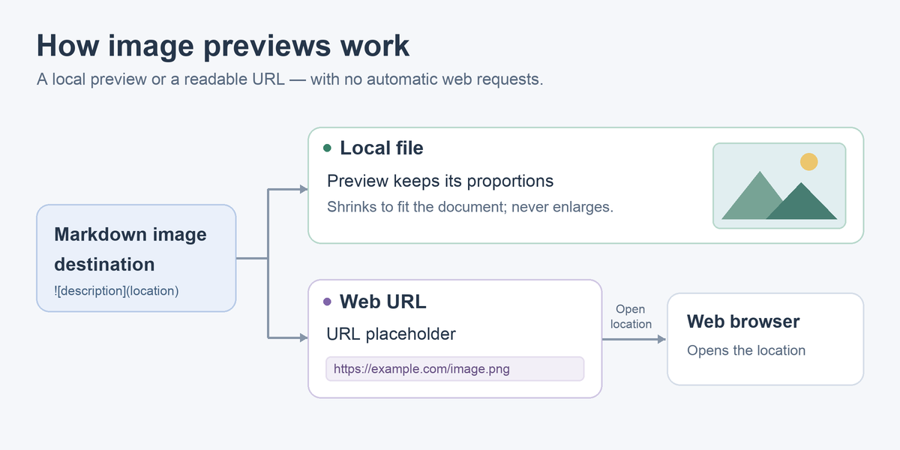
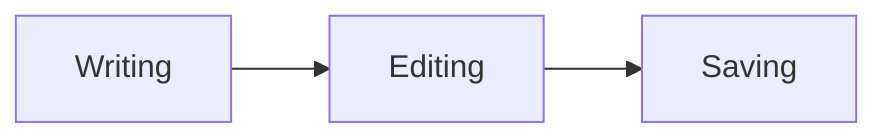

# Viem Markdown demo

Open this file in Markdown Source, then switch to Markdown WYSIWYG. The original source is preserved when switching views and when saving without edits.

In Settings > Editing, **Automatically format typed Markdown** is on by default.
In WYSIWYG, type `*italic*`, `**bold**`, `***bold italic***`, `~~strike~~`,
backtick-delimited code, or `[label](https://example.com)` to complete a formatted
span. At a paragraph's start, a space after `#` through `######`, `>`, `-`, `*`,
`+`, or a decimal list marker activates that structure. Three backticks or tildes
immediately make a literal paragraph a Code Block and put the caret at its start.
`---`, or `___ ` and `*** ` with a trailing space, create thematic rules.
Control-Q before a character keeps it literal, including after
saving and reopening. Disabling the option restores literal WYSIWYG input;
Source, Text and Code input are unaffected.

## Paragraphs and line breaks

This sentence is written across
several source lines. In WYSIWYG they form one flowing paragraph.

This is a separate paragraph, with **bold**, *italic*, ***bold italic***, and ~~strikethrough~~ text. Nested formatting includes **bold with *italic inside*** and *italic with **bold inside***.

Underscores inside identifiers stay literal: `snake_case_name` and snake_case_name. Escaped punctuation also stays literal: \*stars\*, \_underscores\_, \[brackets\], and \# a hash.

This line ends with two spaces.  
This line ends with a backslash.\
This line uses an inline HTML break.<br>
All four lines belong to one paragraph.

Character references: &amp; &lt; &gt; &quot; &copy; &eacute; &#9733; &#x1F642;.

### Heading level three ###

#### Heading level four

##### Heading level five

###### Heading level six

Setext heading level one
========================

Setext heading level two
------------------------

## Lists and containers

- A tight bullet list
- A second item with **bold** text
  - A nested bullet
    1. A nested numbered item
    2. Another nested numbered item
- A final top-level bullet

1. A numbered list
2. The second item
3. The third item

A separate numbered list can begin at a different number:

7. A list may start at a number other than one.
8. Its displayed numbers continue from that start.

An ordered child starting above one needs a blank separator. Without it, the
number stays visible as continuation text:

- Parent prose
  4. This is literal continuation text.
- Another parent

  4. This is a numbered child after a blank separator.
  5. Its sibling continues the run.

- This is a loose list.

- Its items have paragraph spacing.

  This is a second paragraph within the same item.

- ### A heading inside a list

  > A quotation inside this item.

  ```
  Literal code inside this item.
  ```

> A block quotation with **bold** and *italic*.
>
> A second paragraph inside the quotation.
>
> > A nested quotation has its own inset and border.
>
> ### A heading inside a quotation
>
> - A quoted list item
> - Another quoted list item
>
> ```
> Quoted code keeps the Code Block style.
> *These asterisks remain literal.*
> ```

## Links, images and visible references

An ordinary [inline link](https://example.com "Example title") hides its destination in WYSIWYG and uses the Link style. A [**formatted link label**](https://example.com/path) can contain emphasis.

Use the toolbar's Insert Link button to link selected text, or enter Text and
Destination at the caret. Leaving Text blank uses the destination as its label.
Placing the caret in an inline link shows its
destination with Open, Copy, Edit and Remove actions. In Source view, the full
`[text](destination)` notation activates that popup.

Try [jumping to Literal code](#literal-code), opening the
[Markdown compatibility notes](../MARKDOWN_GAPS.md) in Viem, or opening the
[GFM specification](https://github.github.com/gfm/) in your browser. Local links
focus an existing view of that document when it is already open; otherwise they
open a new window.

Angle autolinks: <https://example.com> and <writer@example.com>.

Automatic links: https://example.com/path, www.example.com, and writer@example.com.

Insert Image sits beside Code Block in the toolbar. In WYSIWYG, local images
preview at their intrinsic size or shrink proportionally to fit the content
width. Click an image or move the caret onto it to see its selection
outline and location popup; Edit expands that popup to change its location and
alternative text. Source exposes the complete image notation.

Standalone images use the **Image** paragraph style. Edit that style to change
margins, borders and padding; its font also applies to image location labels and
image notation in Source. Inline images keep the surrounding paragraph layout.
In WYSIWYG, Reload (beside Delete) rereads a local image after it changes on disk.

This screenshot uses a same-directory path containing a space:


The diagram below uses `../examples/markdown-image-flow.png`, resolved relative
to this document in `docs/`:



Remote images display their URL inside a placeholder box. Viem never downloads
these resources. Opening the location explicitly uses your default browser.
Try the image's location popup or [open Google's favicon](http://google.com/favicon.ico).


This deliberately missing local file shows a broken-image icon followed by its
destination. Create the file later and click Reload in the image popup to retry:


Reference links and definitions retain their visible brackets in the
light-purple Markdown reference style. Resolved reference images still preview:

[Full reference][example]

[example][]

[example]

![Reference image][example-image]

[example]: https://example.com "A reference definition"
[example-image]: <Word style.png>

## Literal code

Inline `code` is monospaced and dark green. Double backticks allow a literal backtick: ``code with a ` backtick``. Code does not interpret *emphasis*, &amp;, or links.

```rust
// A language annotation is retained; syntax highlighting is not enabled.
fn main() {
    println!("Hello, Viem!");
}
```

~~~
Tilde fences work too.
**literal bold markers** and <b>literal HTML</b>
~~~

  ```
  This fence is indented by two spaces.
    These two additional spaces stay in the code.
  ```

    Four spaces start an indented code block.
    Blank lines within the block remain literal.

        Extra indentation is retained.

## Thematic breaks

Three supported spellings of a horizontal rule follow, with a paragraph between each so they can be inspected separately.

---

The first rule uses hyphens.

* * *

The second uses spaced asterisks.

___

The third uses underscores.

## Passive HTML and comments

Inline HTML supports <b>bold</b>, <em>emphasis</em>, <del>deleted text</del>, <code>code</code>, <kbd>keyboard text</kbd>, and <u>underlined text</u>.

A visible <!-- inline comment --> uses the Comment character style.

<!-- A standalone comment remains visible and editable in Viem. -->

<div>
<p>An HTML paragraph with <strong>strong text</strong>.</p>
<p>Markdown *inside this raw HTML block* remains literal.</p>
</div>

<pre>Preformatted HTML preserves
    indentation and line breaks.</pre>

## Intentional empty paragraphs

The larger separator below keeps an editable empty paragraph in Viem.


This paragraph follows that empty paragraph. GitHub collapses surplus blank separator lines.

## Tables

Columns grow to fit their contents. Explicit breaks add lines inside a cell;
Source view keeps the markup visible and aligns it without changing its bytes.

| Feature | Example | Count |
| :--- | :---: | ---: |
| Inline formatting | **Bold**, *italic*, and `code` | 12 |
| Explicit breaks | First line<br>Second line | 2 |
| Protected pipes | a\|b and `c\|d` | 4 |
| Empty cells | | 0 |

Header-only tables are valid too:

Left | Center | Right
:-- | :-: | --:

Tables also retain the inset of their enclosing list or quotation:

- A list item with a table

  | Item | Value |
  | --- | ---: |
  | Inside the list | 4 |

> | Quoted item | Value |
> | --- | ---: |
> | Inside the quotation | 7 |

## Unsupported GitHub features

The following examples intentionally demonstrate features that Viem does not implement. Remote-image placeholders and literal reference links above are deliberate presentation choices; local Markdown images preview without network access.

### Task-list checkboxes

- [ ] An unchecked task remains ordinary list text.
- [x] A checked task does not become an interactive checkbox.

### Footnotes and alerts

A footnote reference[^demo-note] does not create a note or backlink.

[^demo-note]: This remains source text.

> [!NOTE]
> Alert titles and icons are not implemented.

### Math and diagrams

Inline math stays literal: $x^2 + y^2 = z^2$.

$$
\int_0^1 x^2\,dx = \frac{1}{3}
$$



### Other GitHub features

Emoji shortcodes such as :smile: stay literal. Repository mentions such as @example, issue references such as #123, and a generated table of contents are not implemented. Heading links such as [Literal code](#literal-code) navigate within this document. Fenced language names do not enable syntax highlighting.
